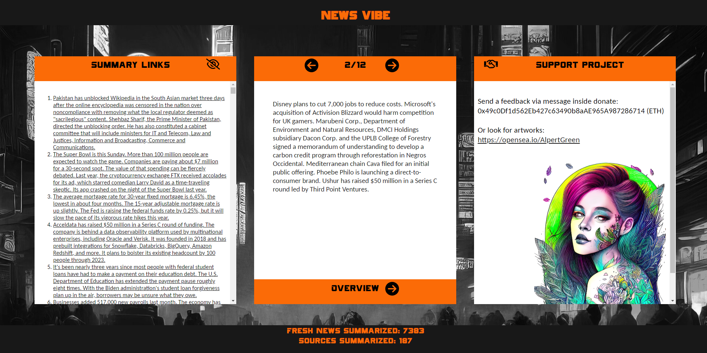
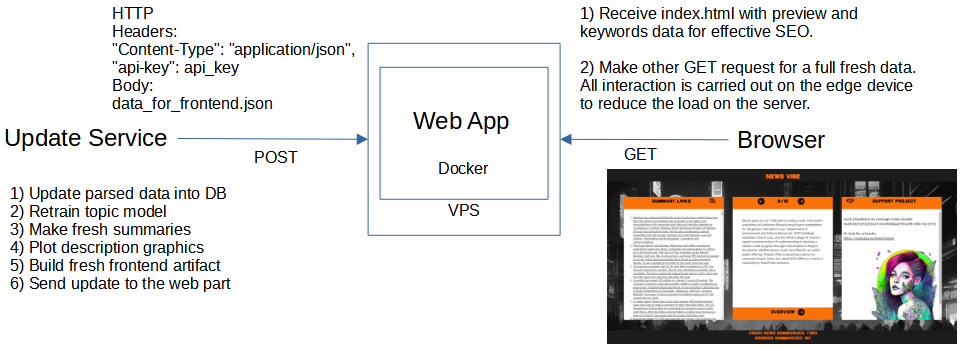

# Preview

# About

Web part of my news analyzing service. It sends UI for GET requests and receiving POST requests to update data for frontend from update service.

# Installation

Generate API key by ./scripts/make_api_key.py and place it into ./data/valid_api_keys.txt and copy this file to newsvibe_update_service_public_version/data/production/.
There is Dockerfile. Full docker launch README.md is in ./docker_utils.
To install without Docker follow instruction inside ./install_without_docker.txt
